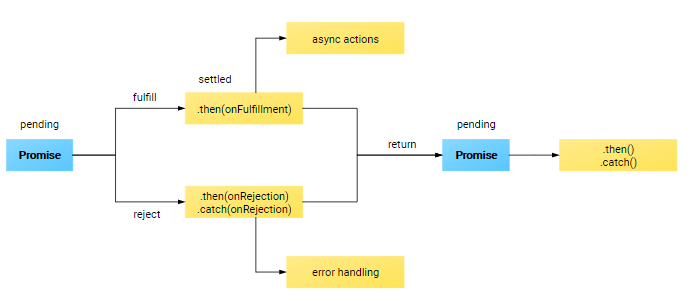

### 什么是Promise ?
1.ES6新增语法(对象)  
2.一个容器，里面保存着某个未来才会结束的事件的结果   
3.异步编程的解决方案，使得异步函数以同步的方式表示，避免了传统异步处理的回调地狱。    

### 回顾我们曾经一度使用的回调
首先我们模拟一个场景，比如我们要发起三个网络请求，request1、request2，request3。request2依赖于request1的请求完成才能发起请求，request3依赖于request2的请求完成。按照以前我们实现异步回调的方式，如下：
示例1：   
```
request1(function (res1) {
	console.log(res1);

	request2(function (res2) {
		console.log(res2);

		request3(function (res3) {
			console.log(res3);
		})
	})
})
function request1(fn) {		
	setTimeout(function () {
		fn("request1");
	},1000)		
}
function request2(fn) {
	setTimeout(function () {
		fn("request2")
	},500)				
}
function request3(fn) {
	setTimeout(function () {
		fn("request3")
	},700)	
}
```
这种业务逻辑应该是我们在处理请求的时候经常会遇到的，并且跟我上面实现的代码逻辑也类似。我们忍不住会想，如果依赖的请求再多来几层，那么异步的回调嵌套岂不是越来越深，多丑啊？确实如此，虽然回调嵌套层数较多的场景不是太多，但是一旦我们遇到了，就会进入不断的写嵌套回调的魔咒，这就是我们常说的回调地狱。

### 且看Promise如何处理回调

按照上面的业务场景，使用Promise进行重写：    
示例2：
```
var request1 = new Promise(function (resolve, reject) {
	var data = "1";
	setTimeout(function () {
		if (data) {
			console.log("request1 success")
			resolve("request1 success");
		}else{
			reject("request1 error");
		}
	},500)
});
request1
	.then(request2)
	.then(request3);
	
function request2(data) {
	return new Promise(function (resolve, reject) {
		setTimeout(function () {
			if (data) {
				console.log("request2 success")
				resolve("request2 success");
			}else{
				reject("request2 error");
			}
		},700)
	})	
}
function request3(data) {
	return new Promise(function (resolve, reject) {
		setTimeout(function () {
			if (data) {
				console.log("request3 success")
				resolve("request3 success");
			}else{
				reject("request3 error");
			}
		},800)
	})	
}
```
有没有很吃惊Promise的能力，完全颠覆了我们对异步操作的认知，比着示例1，异步代码看着像写同步代码一样，回调层数较多时，嵌套调用变成了链式调用，代码的组织方式更加优雅和整洁。现在我们了解到了Promise的强大了，那么接下来就分析下Promise的语法。

### Promise简介
#### Promise-构造函数
通过 `new` 初始化一个Promise实例对象作为接口。

```
var promise = new Promise(function(resolve, reject){

})
```
#### Promise-状态
Promise存在以下三种状态：
`pending`: 初始化状态，操作未fullied(完成)或者reject(失败)   
`fulfilled`: 操作成功完成   
`rejected`: 操作失败   
一个处于pending状态的Promise对象，随时可能会在成功(fulfilled)时返回一个值，也可能失败(rejected)是返回原因。无论是成功或者失败，只要触发了，Promise 的 then方法关联的事件队列将会被执行，不管成功或者失败，二者只会被触发其中一个（要么成功，要么失败），所以两种情况下触发的then不存在冲突，如下图：



从图片里面可以看出Promise的执行逻辑：   
##### 1.初始化Promise对象(pendding状态)。
```
var promise = new Promise(function(resolve, reject){

})
```   
##### 2.异步成功(fulfill，调用resolve(data))或者失败(reject，调用reject(err))。
```
var data = {"name": "chaoshen"};
var promise = new Promise(function (resolve, reject) {
	if (data) {
		//数据正常时
		resolve(data);
	}else{
		//数据异常时
		reject("data is error!")
	}

});

```   
##### 3.设置异步结果监听then(成功或者失败时触发)或者catch(失败时触发)
```
promise
	.then(function (data) {
		// 成功时触发
		console.log(data);
	}, function (err) {
		// 失败时触发，只监听当前promise对象的异常
		console.log("1"+err);
	})
	// 监听所有promise对象的异常，如果某个promise对象then属性中传入两个回调函数（即第二个函数已是监听异常函数），那么当该promise发生异常时只会触发其then内部的异常函数，catch将不会被触发。
	.catch(function (err) {
		console.log(err);
	})


```

##### 4.如果存在异步嵌套的话，Promise可以这样使用
```
<!-- 将第3步代码替换为如下 -->

promise
	.then(promise2)

	// 此时then监听的是promise2对象，因为上面promise2函数触发后返回了一个新的promise对象
	.then(function (data) {
		console.log(" recieve promise2's data");
		console.log(data);
	})

	// catch 监听所有promise对象的异常，如果某个promise对象then属性中传入两个回调函数（即第二个函数已是监听异常函数），那么当该promise发生异常时只会触发其then内部的异常函数，catch将不会被触发。
	.catch(function (err) {
		console.log(err);
	})

function promise2(data) {
	<!-- 返回Promise对象，将上下文切换为新的Promise对象 -->
	return new Promise(function (resolve, reject) {
		if (data) {
			resolve(data);
		}else{
			reject("promise2 is error");
		}
	})
}

```
#### 方法
Promise.all(iterable)


